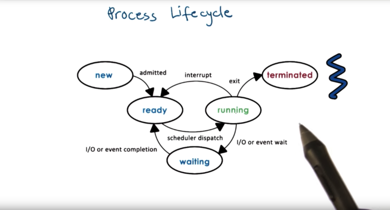
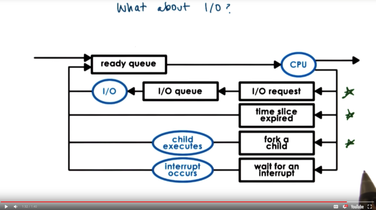

# Introduction to OS

## 定义

- 计算机由一系列硬件组成(大概):
  - Central Processing Unit (CPU)
  - Physical Memory
  - Network Interfaces (Ethernet/Wifi Card)
  - GPU
  - Storage Devices (Disk, Flash drives [USB])

​	

- 同时, 计算机上又可以运行一系列 higher level 的应用.

  

- 操作系统定义: 

  - `1.` **The Operating System is the layer of software that sits between the hardware components and the higher level applications.**

  - `2.`An operating system is a layer of systems software that

    - directly has privileged access to the underlying hardware; 
    - manages hardware on behalf of one or more applications according to some predefined policies.
    - Ensures that applications are isolated and protected from one another

    

## 主要功能

- Hide hardware complexity.
  - 操作系统提供了高阶的抽象概念, 如文件, 以及一系列操作, 如读写, 来隐藏了复杂的硬件操作, 简化了应用开发.

- Manage underlying hardware resources.
  - 操作系统负责资源的调度. 资源包括内存, CPU, 网络等.

- Provides isolation and protection.
  - OS确保多个运行的应用不互相干扰, 保护应用正常运行.

## OS Element

- 操作系统提供了一系列高阶抽象概念, 以及相应的操作机制

- 例:
  - 抽象概念:
    - 应用抽象: process, thread
    - 硬件抽象: file, socket, memory page
  - 操作机制:
    - create / schedule
    - open / write / allocate
  - policy:
    - 可能还有一定的policy来决定: how the mechanisms will be used to manage the underlying hardware.

## OS 设计原则

- Separation of mechanism and policy
  - 操作机制应当足够灵活, 以能够支持多种policy (以内存管理为例, LFU, LRU, random)

- Optimize for common case
  - 设计policy时, 考虑用在什么地方, 想要什么过程, 需要什么前提

## Protection Boundary

- 计算机**至少**具有两种执行模式:
  - user-level (unprivileged)
  - kernel-level (privileged)

- OS 一定是privileged的, 因此必定在kernel mode中执行. 应用一般在user mode执行.
- 因此, 只有OS能直接操作硬件. 应用要获取硬件资源, 只能通过OS.
- 今天的绝大多数操作系统都支持从user mode cross到kernel mode.
- 当一个non-privileged execution需要执行一个privileged instructions时, 应用就变为`trapped`. 即, 应用的执行被打断, 控制的权限交给了OS. OS可决定, 是给与权限, 还是终结该应用.
- OS 同时也提供了一个接口: `system calls` 来供应用调用, 这样应用就可以获得权限来访问硬件资源.
  - 如: `open` (file), `send` (socket), `mmap` (memory)

- OS还支持`signals`, 通过它OS可以向应用发送notifications.

## System Call Flow

- 执行的process需要操作硬件时, 使用system call并将控制权交给OS, OS执行完毕之后再将相关数据返回process.
- context switch: 这个过程中, process从user mode进入kernel mode, 又返回user mode.
- 这一操作可能会比较耗资源.
- 同步模式中, 进程移交控制给OS后就进入阻塞状态, 等到返回的结果后才继续执行. 当然, 也存在异步的模式.

- 硬件支持
  - 当非法(超出权限)操作发生时, 硬件就会有一个trap
  - 当trap发生时, 硬件启动一个流程, 把控制权从应用转移给OS, 也就发生了user/kernel transition
  - 消耗: 除了transition本身的耗时以外, CPU cache中原本的应用数据也会被OS数据替代, 这也拖慢了应用后续的运行

## OS service

- 前文提到, OS为应用提供了操纵硬件的接口
- 这些接口由一系列service组成
  - 有些service一般直连硬件
    - Scheduling component (CPU)  
    - Memory manager (physical memory)
    - Block device driver (block device)
  - 有些则是更高层的抽象, 并不直连, 如文件系统.

- 基本的service包括:
  - Process management
  - File management
  - Device management
  - Memory management
  - Storage management
  - Security

## OS架构

### 单体式(monolithic)

- 特征: 无所不包, 提供各种功能的一个整体
- 优劣:
  - Pros
    - Everything included
    - Inlining, compile-time optimizations
  - Cons
    - No customization
    - Not too portable/manageable
    - Large memory footprint (which can impact performance)

### 模块式(modular)

- 特征
  - 在提供了一些最基本的服务和API后, 可以像添加插件一样添加其他的功能模块
  - 为应用提供了很大的灵活性, 应用可以自己选择最合适的调接口的方法
  - 可以动态的在OS中安装新的模块
- 优劣
  - Pros
    - Maintainability
    - Smaller footprint
    - Less resource needs
  - Cons
    - All the modularity/indirection can reduce some opportunities for optimization (but eh, not really)
    - Maintenance can still be an issue as modules from different codebases can be slung together at runtime

### 微内核(microkernel)

- 特征
  - 只包含最基本的OS组件, 其他所有都在OS之外, 在user-mode中运行
  - 这种设置导致运行过程中需要大量进行 interprocess communication (IPC, 进程间通信). 相反, 传统OS中OS组件是在进程内被直接调用的.
  - 因此, microkernel 通常支持IPC, 这也是它核心的一个抽象概念.

- 优劣
  - Pros
    - Size
    - Verifiability (great for embedded devices)
  - Cons
    - Bad portability (often customized to underlying hardware)
    - Harder to find common OS components due to specialized use case
    - Expensive cost of frequent user/kernel crossing

## 例子: Linux与Mac OS架构

### Linux

- 自底向上的层次结构:

  - Hardware

  - **Linux Kernel**

  - Standard Libraries (sys call interface)

  - Utility program (shells/compiler)

  - User applications

- Kernel consist of several logical components

  - Virtual file system

  - Memory management

  - Process management

- Each subcomponent within the three above can be modified or replaced 'cause modularity!

### Mac OS X

- I/O kit for device drivers
- Kernel extension kit for dynamic loading of kernel components
- Mach microkernel *memory management* thread scheduling * IPC
- BSD component *Unix interoperability* POSIX API support * Network I/O interface
- All applications sit above this layer

# Processes and Process Management

## 进程

- When an application is stored on disk, it is static. Once an application is launched, it is loaded into memory and starts executing; it becomes a **process**. A process is an active entity.
  - 进程是活在内存里正在执行的应用程序.

- 进程具有一定的执行状态. 同一个程序, 分别执行两次产生的两个进程, 它们的状态不一定相同.

## 进程本质

- 进程封装了正在运行的应用程序的所有状态(all of the state).
  - 包括: 代码, 数据, 堆, 栈
  - 这些元素一定要能够**uniquely identified by its address**
  - OS提供了一个抽象概念 **address space** 来封装这些状态.

- Different types of process state in an address space:
  - The code
  - The data available when process is first initialized (static state)
  - Heap: Dynamically created state (what we create) * Seems contiguous but there are holes filled with garbage (think of C struct not `memset`)
  - Stack: Dynamically created state that grows and shrinks as the program executes *LIFO* Stack frames added and removed as functions are called and return

## 进程地址空间

- 一个进程的address space的地址范围是从$V_0$ 到 $V_{max}$.

  - 这些地址是virtual address, 因为他们在物理内存上不一定是连续的.

    

- OS把这些virtual address和物理内存中的address map了起来. 

  - 这样就实现了解耦合, 虚拟内存的层次结构和物理内存的无关.
  - 记录这种mapping的是 `page table`
  - 通过这种做法, 进程不需要知道物理地址就能调用数据.

## 地址空间与内存管理

- 有时, 内存的大小可能不足以放下所有进程的状态信息.
- OS会动态地决策, 将部分地址空间map到内存, 而另一部分暂时的map到硬盘.
- 此外, OS还需要检测memory access的validity, 来保证进程A不能修改B的数据, 即保证进程之间互不干扰, 

## 进程执行状态

- CPU在执行一个程序的代码时, 会记录当前执行到了哪一行. 这个记录称为`Program Counter`.
- 在CPU执行某程序时, 当前程序的状态信息, 以及program counter, 都存放在CPU `register`中. (寄存器, 小容量, 超高速读写).
- address space中的stack同样也定义了当前进程执行的情况. 栈的顶部定义为`stack pointer`.
- 对某个进程, OS将其信息放在 `process control block, PCB`中.

## PCB

- PCB是OS持有的, 记录其管理的进程的数据结构.
- PCB中存储的信息包括:
  - process state
  - process number
  - program counter
  - CPU registers
  - memory limits
  - CPU scheduling info
  - and more!

- 在进程启动时, 其相应的PCB也被创建并初始化.
- 随着进程状态变化, PCB中的某些field也随之改变.
- 有些field经常变化, 如program counter, 所以它是放在cpu register中update, 效率更高.
- OS应收集CPU register中存储的关于进程的数据, 并在进程不再运行(注意: 只是不运行, 不一定是结束, 可能是挂起) 之后, 将数据同步到PCB中.

## PCB工作流程

- 进程挂起/结束时, PCB存储在内存中. 
- 进程启动/恢复执行时, PCB存储在CPU register中

- 进程切换: 当进程被OS中断执行时, OS从register中获得PCB, 同步到内存中. 之后, OS又把新的进程的PCB放到CPU的register中, 开始新进程的执行.
- OS切换进程的这种行为称为context switch.

## context switch

- expensive operation
- 来算账
  - 直接的cost: 需要一定的CPU cycle (基本时间单位, 指CPU完成一个基本操作所需的时间)来从在内存和register之间做PCB的同步.
  - 间接的cost: 进程执行时, 除了register中有PCB数据外, 还有其他一些相关数据存储在CPU 的cache中 (此时称为`hot cache`; cache读写远快于内存.) . 切换之后, cache中有关原进程的数据被清空 (被新进程顶替), 哪怕切换回来, 也只有PCB被同步, 原本cache中的数据不复存在, 运行时又需要花费很多cycle重新从内存中去获取 (`cold cache`).

- 开发者应尽量减少context switch的次数.

## 进程生命周期

- `new`: 进程创建, OS做admission control, 为PCB分配内存并将其初始化
- `ready`: 等待调度执行
  - 初始化完成后, 进入ready状态
  - 运行中被打断后, 进入ready状态	
  - 阻塞操作完成后, 进入ready状态
- `running`: 数据进入CPU, 执行
- `waiting`: 遇到需要等待的事件 (I/O, 锁) 
- `terminated`: 出错或不出错地结束

- 一个进程可以创建多个子进程
- OS本身是最先启动的根进程
- 绝大多数OS支持两种机制来创建进程
  - fork
    - 为子进程创建PCB并完全复制根进程数据. 因此, 两进程会以完全相同的state开始后续的执行(之后不一定相同了), 他们具有同一个program counter (也即是说, 都运行到了代码第n行).
  - exec
    - 先使用fork创建一个PCB. 然后, 将PCB赋予新进程, 且不保留原本的数据. 相当于子进程独立于根进程做了初始化. 子进程从头开始运行.

## CPU调度

- 进程若要被CPU执行, 必须处于ready状态.
- 一个CPU可能面对多个ready的进程, 选择哪一个来执行由CPU scheduler决定.
  - scheduler决定下次哪个进程使用CPU, 以及它能用多久.

- OS应拥有以下操作
  - preempt: 中断当前进程, 保存其context
  - schedule: 运行scheduler来选择接下来要运行的进程
  - dispatch: 选择完成后, 将选择的进程打包复制好, 切换到其context

- CPU的资源宝贵. 因此, 调度的策略应尽量保证, 在总的运行时间中, 进程处于running状态的时间尽可能地多.

## 进程运行时间

- 进程运行时间和CPU效率相关. 
  - 假设每次调度花费1单位的时间. 若一个进程每次运行1之后就会wait/被interupt, 则一半的时间CPU都在调度, 效率仅有50%.
  - 若运行9之后才需要调度, 则效率达到了90%.

- 分配给一个进程, 让其执行的时间称为`timeslice`.

- 设计scheduler时, 有一些重要的决策:
  - timeslice多大比较合适
  - 以什么为指标来选择下一次运行的进程

## I/O

- 当进程发起I/O请求, OS会传递该请求并将进程放在`I/O队列`中. 当请求完成后, 进程从I/O队列中移出, 又被放置在`ready队列`中.
- 进程可以通过几条路来进入`ready队列`

## Inter Process Communication

- 进程之间可以通信. 现在的应用可能一个应用就包含多个进程, 那么当然要让他们通信才能彼此协调.

- 允许进程通信的机制称为 Inter Process mechanisms. (IPCs)

- 这些机制实质上是 在维持protection和isolation的前提下, 实现了在不同的address space之间传输数据.

- 有几种类型的IPCs:

  - Message Passing IPC

    - OS建立起一条通信队列(或者说shared buffer), 两个进程都拥有对队列的访问权限. (一方读, 一方写).
    - 好处: 由OS管理, 而OS中已经有现成的system call来读写 (人话: 好实现)
    - 坏处: overhead (耗资源). 
      - 要求分配一定内存给kernel
      - 信息从sender address space拷贝到kernel管理的内存, 又要从中拷贝到receiver的address space

    

  - Shared Memory IPC

    - OS在创建PCB时, 让两个进程有一部分重叠的地址, 它们都对其具有访问权限 (都可以读写).
    - 好处: 节约资源.
      - OS在创建PCB后, 就完全不需要管理这些事情了. 
      - 数据直接写直接读, 不用复制来复制去
    - 坏处
      - 不好实现. 因为不涉及OS, 所以很多API要自己去实现.

